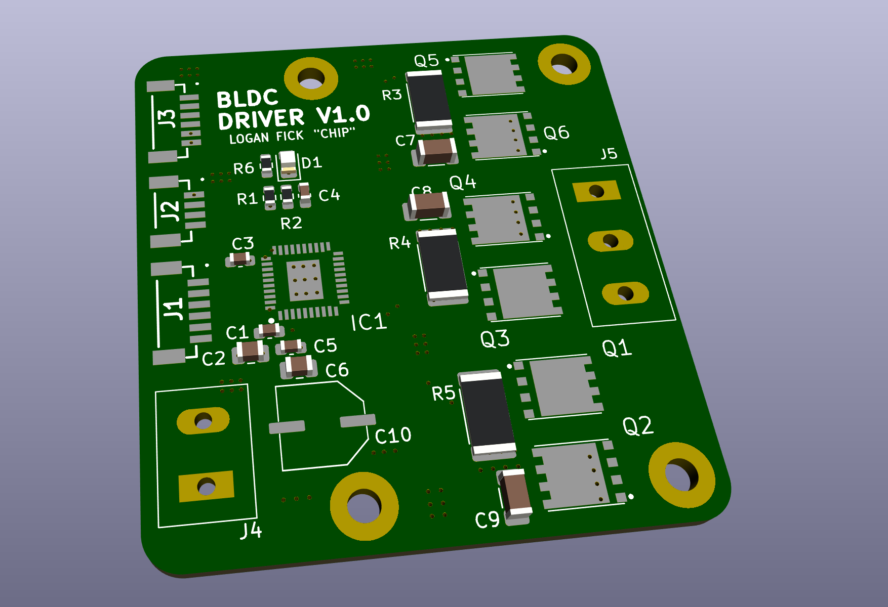
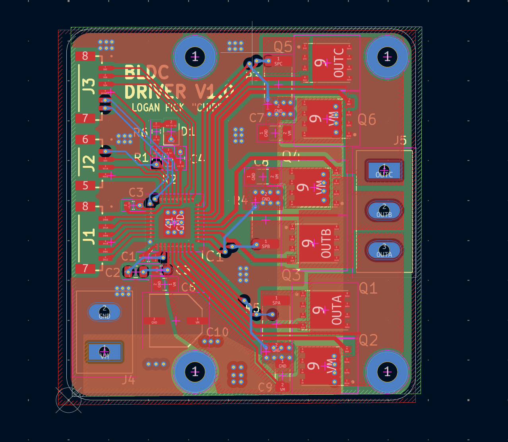
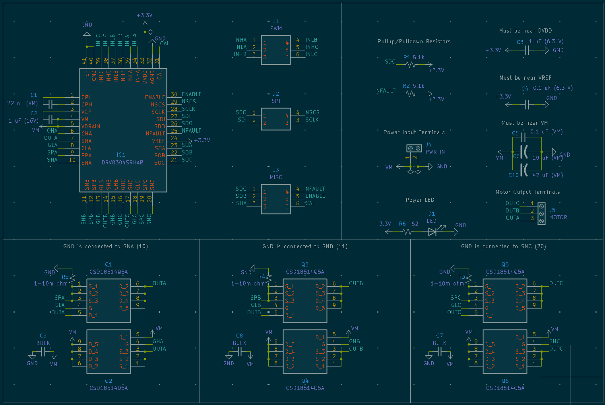

<div align="center">
    
    <br>
    <h3>TI DRV8304 BLDC Motor Controller PCB</h3>
    <p>
    A 6S motor controller based on the TI-DRV8304 Gate Driver IC for SimpleFOC.
    </p>
    <br>
    <a href="https://www.loganfick.com/projects/bldc-results">See my post on my Website</a>
</div>

<hr>

This repository contains all of the KiCad files to my BLDC motor controller project, it is based on the example schematic from the 
[datasheet](https://www.ti.com/lit/ds/symlink/drv8304.pdf?ts=1788095971336&ref_url=https%253A%252F%252Fwww.ti.com%252Fproduct%252FDRV8304%253FkeyMatch%253DDRV8304HRHAR%2526tisearch%253Duniversal_search%2526usecase%253DOPN-ALT).

<br>

<div align="center">
    
    
</div>

It was tested and was able to spin a 6s motor with the Arduino [SimpleFOC](https://docs.simplefoc.com/) Library.

Read more [here](https://loganfick.com/projects/bldc-results/) on my website!

<!-- TABLE OF CONTENTS -->
<details open>
  <summary>Table of Contents</summary>
  <ol>
    <li><a href="#files">File Structure</a></li>
    <li><a href="#contact">Contact</a></li>
    <li><a href="#acknowledgments">Acknowledgments</a></li>
    <li><a href="#license">License</a></li>
  </ol>
</details>


<!-- CONTACT -->
## Files

The PCB project files can be loaded by clicking ```open project``` in KiCad and selecting the ```motor_controller.kicad_pro``` file.


<!-- CONTACT -->
## Contact

Logan Fick -  loganfickcontact@gmail.com

Project Link: [https://github.com/weasalcrafter/linklite-v2](https://github.com/weasalcrafter/bldc-results)

Website: [https://loganfick.com/projects/linklite-v2](https://loganfick.com/)


<!-- ACKNOWLEDGMENTS -->
## Acknowledgments
These are the tools I used for this project for designing the schematic, PCB layout, and programming.


* [SimpleFOC](https://docs.simplefoc.com/)
* [KiCad 10.0](https://www.kicad.org/)

## License

This project is licensed under the MIT License - see the [LICENSE](LICENSE) file for details.
